# 📱 Ecomly Client

<p align="center">
   <a href="https://flutter.dev/" target="_blank">
      
   </a>
</p>

<p align="center">
   <a href="https://flutter.dev/">
      
   </a>
   <a href="https://pub.dev/packages/flutter_riverpod">
      
   </a>
</p>

---

## 🚀 Overview

**Ecomly Client** is the mobile frontend of the Ecomly ecosystem. Built with **Flutter** and powered by **Riverpod**, it follows a **Clean Architecture** approach to deliver a structured, maintainable, and scalable shopping app. Users can explore products, manage their cart and wishlist, post reviews, and enjoy a smooth and responsive shopping experience.

---

## 🛠️ Tech Stack

- **Flutter** – Cross-platform framework (Android + iOS).
- **Riverpod** – Scoped state management with providers.
- **GoRouter** – Declarative navigation and deep linking.
- **Dio / HTTP** – API communication.
- **Lottie** – Animations for feedback and transitions.
- **Infinite Scroll Pagination** – Paginated product/review lists.
- **Dotenv** – Environment variable handling.

---

## ✨ Features

- 🔑 **Authentication** – Login, register, and session handling.
- 🛒 **Shopping** – Browse, search, and filter products.
- ⭐ **Reviews** – Leave ratings & feedback, view customer reviews.
- 🏷️ **Wishlist** – Add/remove favorite products.
- 🛍️ **Cart** – Add to cart, select size/colour, manage checkout flow.
- 📦 **Categories** – Explore popular, new arrivals, and categorized products.
- 🎨 **UI/UX** – Adaptive theming (light/dark), smooth animations.
- ⚡ **Error Handling** – Snackbar-driven error feedback.

---

## 📸 Preview

<p align="center">
   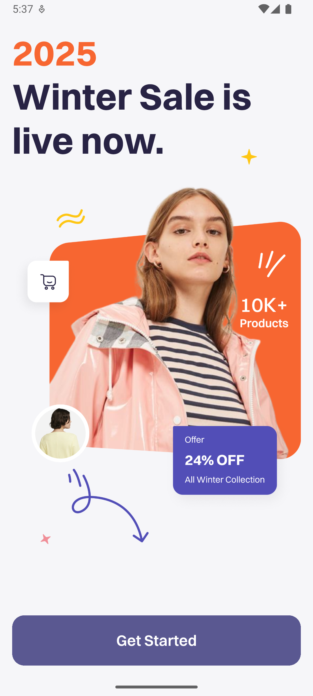
   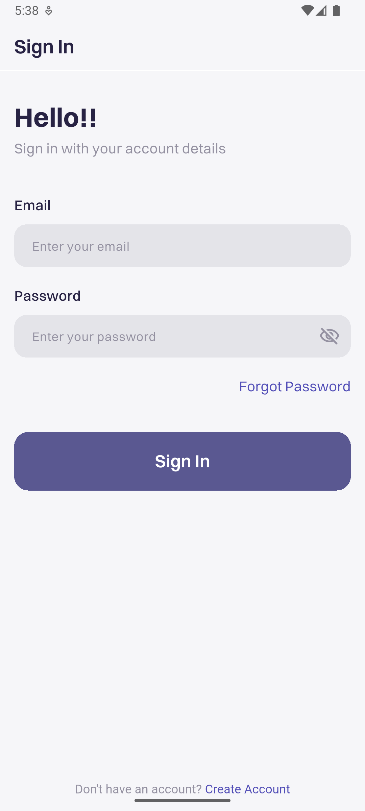
   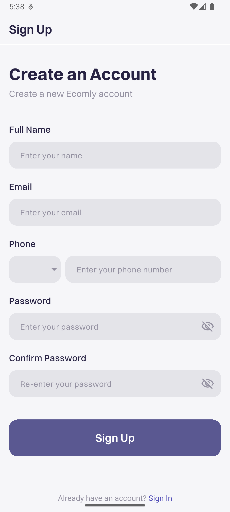
   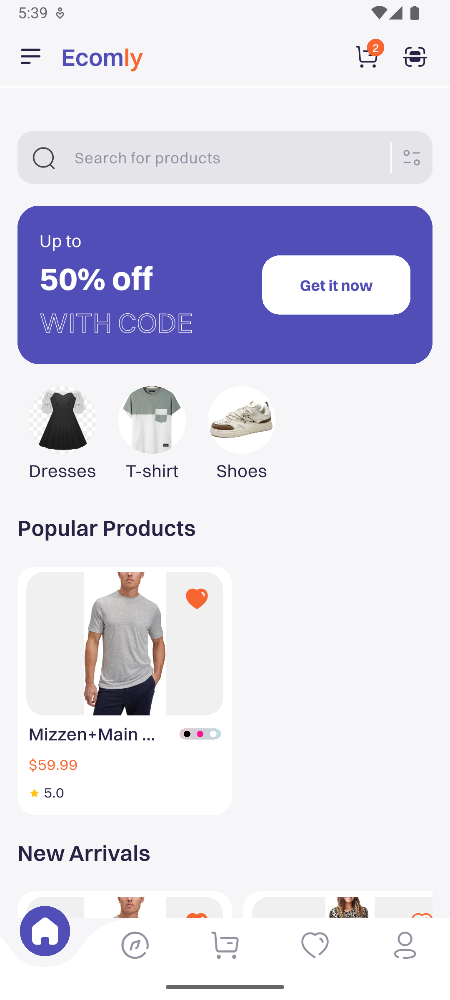
   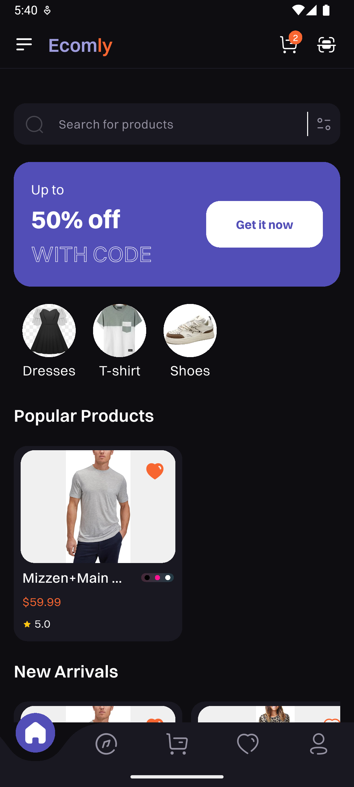
   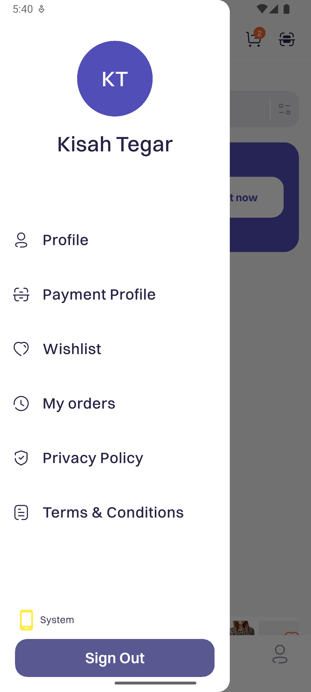
   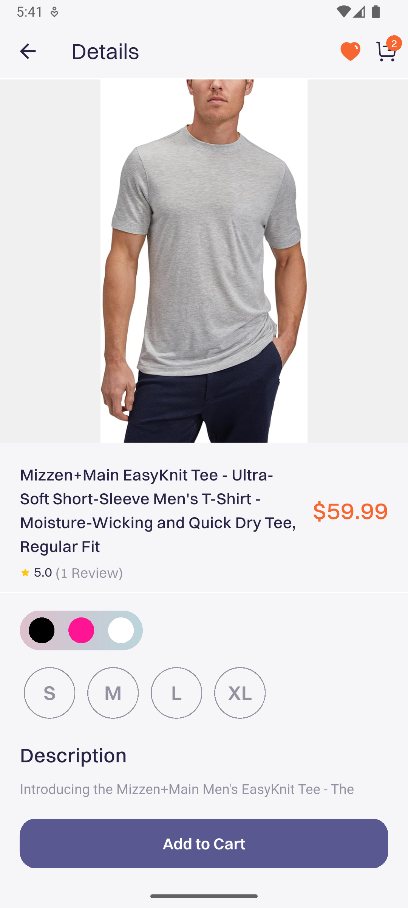
   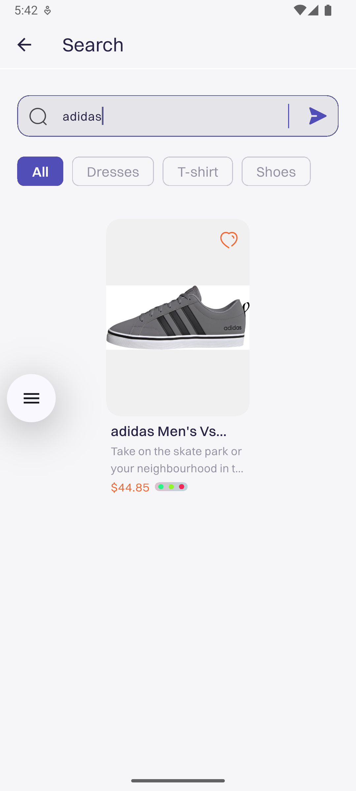
   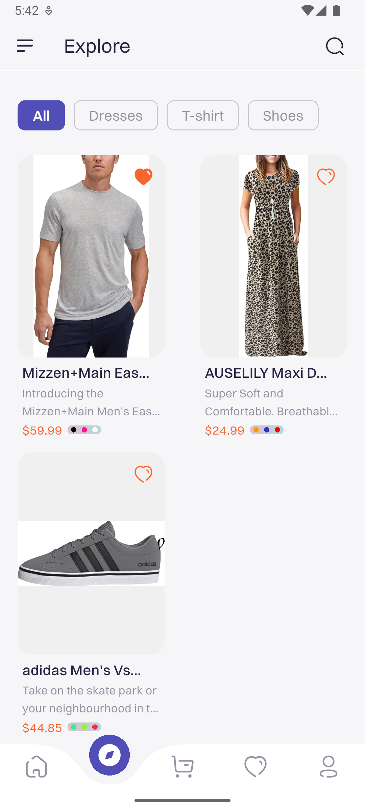
   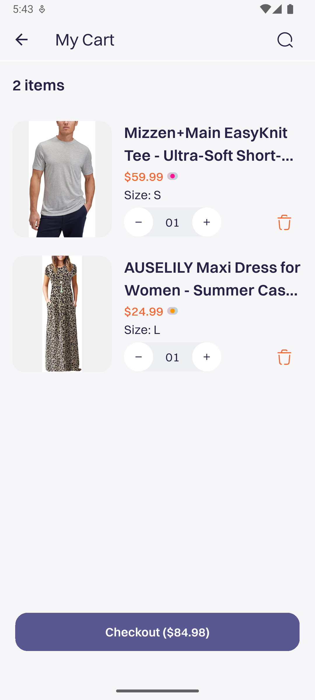
   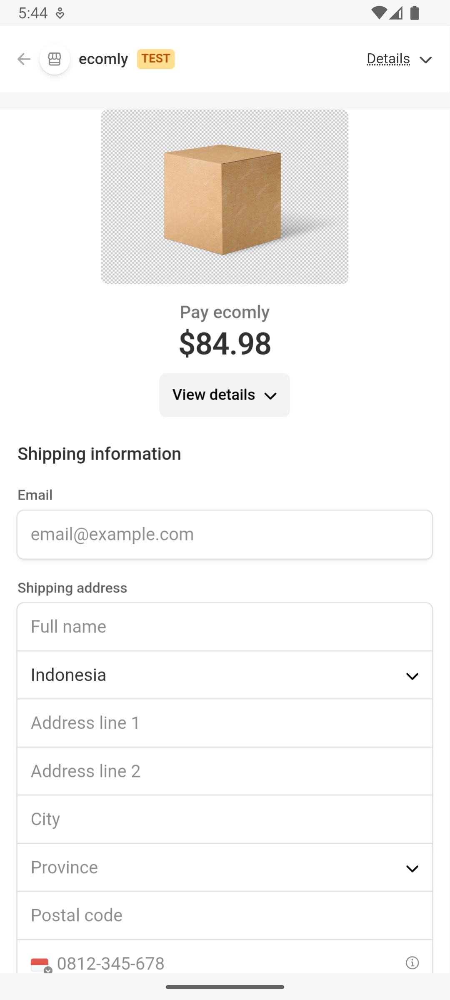
   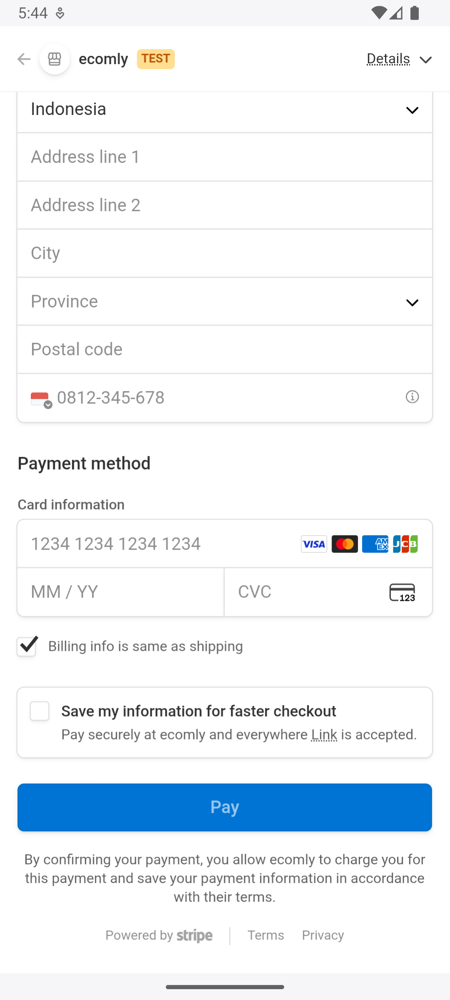
   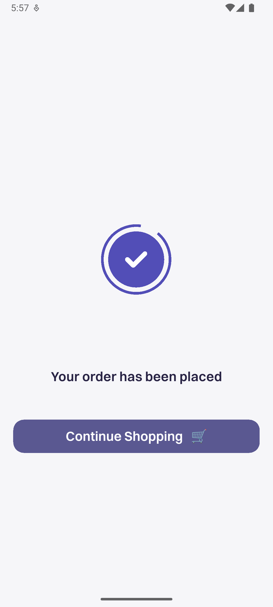
   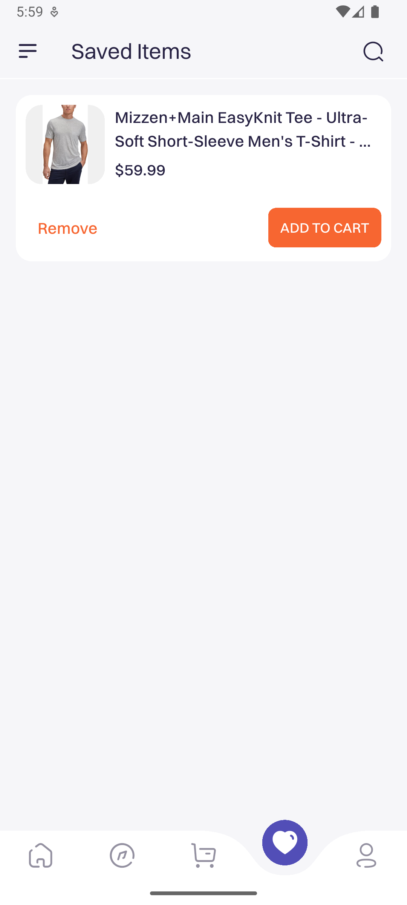
</p>

---

## ⚙️ Installation

### Prerequisites

Ensure you have the following installed:

- [Flutter SDK](https://docs.flutter.dev/get-started/install) (v3.22+ recommended)
- Android Studio / Xcode (emulator setup)
- Backend server running (Ecomly API)

### Steps to Install

1. Clone the repo:

   ```bash
   git clone https://github.com/kisahtegar/ecomly_client.git
   cd ecomly_client
   ```

2. Install dependencies:

   ```bash
   flutter pub get
   ```

3. Create a `.env` file in the project root:

   ```env
   BASE_URL=http://192.168.1.21:3000/api/v1
   AUTHORITY=192.168.1.21:3000
   API_URL=/api/v1
   ```

4. Run the app:

   ```bash
   flutter run
   ```

---

## ▶️ Usage

### Debug Mode

```bash
flutter run
```

### Production Build

```bash
flutter build apk   # Android
flutter build ios   # iOS
```

---

## 🔗 API Integration

The app connects to the **Ecomly Backend API**. Update `.env` values to point to your backend server instance:

- `BASE_URL` → Full API URL
- `AUTHORITY` → Host & port
- `API_URL` → API version path

Example:

```env
BASE_URL=http://192.168.1.21:3000/api/v1
AUTHORITY=192.168.1.21:3000
API_URL=/api/v1
```

---

## 🤝 Contributing

Contributions are welcome! Please follow these steps:

1. Fork the project.
2. Create a feature branch: `git checkout -b feature/my-feature`.
3. Commit your changes: `git commit -m 'Add my feature'`.
4. Push the branch: `git push origin feature/my-feature`.
5. Submit a pull request 🚀.

---

## 👨‍💻 About Me

- 💻 All of my projects are available at [github.com/kisahtegar](https://github.com/kisahtegar)
- 📫 How to reach me: **[code.kisahtegar@gmail.com](mailto:code.kisahtegar@gmail.com)**
- 🌐 Portfolio: [kisahcode.web.app](https://kisahcode.web.app)
